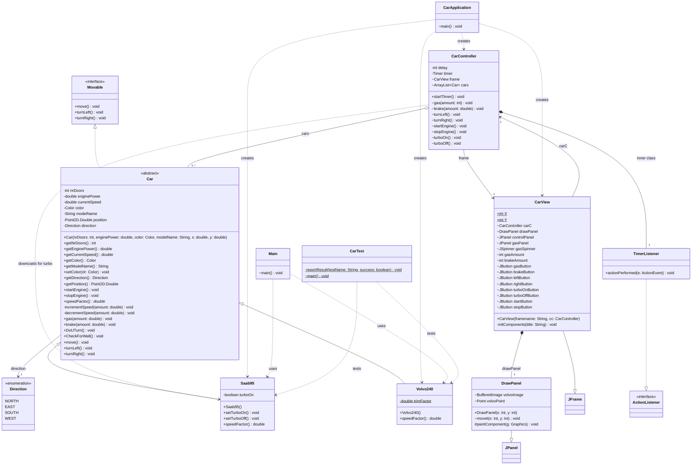

# UML Class Diagram

```mermaid
classDiagram
    direction TB

    %% ===== Model =====
    class Movable {
        <<interface>>
        +move() void
        +turnLeft() void
        +turnRight() void
    }

    class Direction {
        <<enumeration>>
        NORTH
        EAST
        SOUTH
        WEST
    }

    class Car {
        <<abstract>>
        -int nrDoors
        -double enginePower
        -double currentSpeed
        -Color color
        -String modelName
        -Point2D.Double position
        -Direction direction
        +Car(nrDoors: int, enginePower: double, color: Color, modelName: String, x: double, y: double)
        +getNrDoors() int
        +getEnginePower() double
        +getCurrentSpeed() double
        +getColor() Color
        +getModelName() String
        +setColor(clr: Color) void
        +getDirection() Direction
        +getPosition() Point2D.Double
        +startEngine() void
        +stopEngine() void
        +speedFactor()* double
        -incrementSpeed(amount: double) void
        -decrementSpeed(amount: double) void
        +gas(amount: double) void
        +brake(amount: double) void
        +DoUTurn() void
        +CheckForWall() void
        +move() void
        +turnLeft() void
        +turnRight() void
    }

    class Saab95 {
        -boolean turboOn
        +Saab95()
        +setTurboOn() void
        +setTurboOff() void
        +speedFactor() double
    }

    class Volvo240 {
        -double trimFactor$
        +Volvo240()
        +speedFactor() double
    }

    %% ===== Controller =====
    class CarController {
        -int delay
        -Timer timer
        ~CarView frame
        ~ArrayList~Car~ cars
        +startTimer() void
        ~gas(amount: int) void
        ~brake(amount: double) void
        ~turnLeft() void
        ~turnRight() void
        ~startEngine() void
        ~stopEngine() void
        ~turboOn() void
        ~turboOff() void
    }

    class TimerListener {
        +actionPerformed(e: ActionEvent) void
    }

    %% ===== View =====
    class CarView {
        +int X$
        +int Y$
        ~CarController carC
        ~DrawPanel drawPanel
        ~JPanel controlPanel
        ~JPanel gasPanel
        ~JSpinner gasSpinner
        ~int gasAmount
        ~int brakeAmount
        ~JButton gasButton
        ~JButton brakeButton
        ~JButton leftButton
        ~JButton rightButton
        ~JButton turboOnButton
        ~JButton turboOffButton
        ~JButton startButton
        ~JButton stopButton
        +CarView(framename: String, cc: CarController)
        -initComponents(title: String) void
    }

    class DrawPanel {
        ~BufferedImage volvoImage
        ~Point volvoPoint
        +DrawPanel(x: int, y: int)
        ~moveit(x: int, y: int) void
        #paintComponent(g: Graphics) void
    }

    %% ===== Entry points / tests =====
    class CarApplication {
        ~main() void
    }
    class Main {
        ~main() void
    }
    class CarTest {
        -reportResult(testName: String, success: boolean)$ void
        ~main()$ void
    }

    %% ===== Swing (external) =====
    class JFrame
    class JPanel
    class ActionListener {
        <<interface>>
    }

    %% ===== Relationships =====
    Movable <|.. Car
    Car <|-- Saab95
    Car <|-- Volvo240
    Car --> "1" Direction : direction

    CarController o-- "0..*" Car : cars
    CarController --> "1" CarView : frame
    CarController *-- "1" TimerListener : inner class
    CarController ..> Saab95 : downcasts for turbo
    TimerListener ..|> ActionListener

    CarView --|> JFrame
    CarView --> "1" CarController : carC
    CarView *-- "1" DrawPanel : drawPanel
    DrawPanel --|> JPanel

    CarApplication ..> CarController : creates
    CarApplication ..> CarView : creates
    CarApplication ..> Saab95 : creates
    CarApplication ..> Volvo240 : creates
    Main ..> Volvo240 : uses
    Main ..> Saab95 : uses
    CarTest ..> Volvo240 : tests
    CarTest ..> Saab95 : tests
```

**Legend:** `+` public · `-` private · `#` protected · `~` package-private · `$` static · `*` abstract
